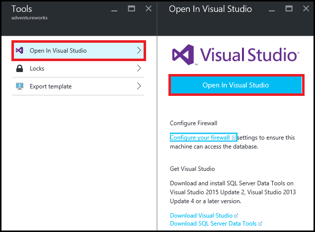
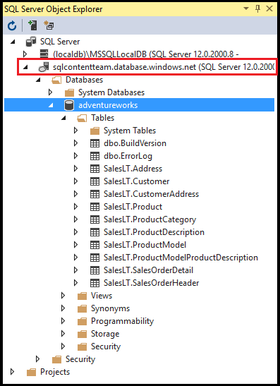
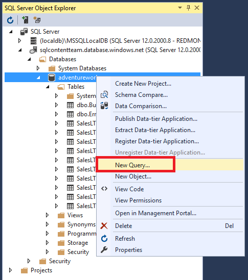
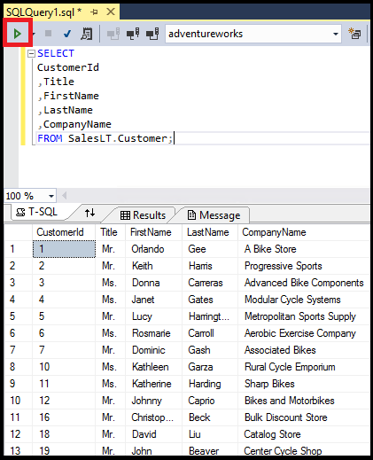

<properties
	pageTitle="使用 C# 查询连接到 SQL 数据库 | Azure"
	description="用 C# 编写用于查询和连接到 SQL 数据库的程序。有关 IP 地址、连接字符串、安全登录和免费 Visual Studio 的信息。"
	services="sql-database"
	keywords="c# 数据库查询, c# 查询, 连接到数据库, SQL C#"
	documentationCenter=""
	authors="stevestein"
	manager="jhubbard"
	editor=""/>  

<tags
	ms.service="sql-database"
	ms.workload="data-management"
	ms.tgt_pltfrm="na"
	ms.devlang="dotnet"
	ms.topic="get-started-article"
	ms.date="08/17/2016"
	ms.author="stevestein"/>  

# 使用 Visual Studio 连接到 SQL 数据库

> [AZURE.SELECTOR]
- [Visual Studio](/documentation/articles/sql-database-connect-query/)
- [SSMS](/documentation/articles/sql-database-connect-query-ssms/)
- [Excel](/documentation/articles/sql-database-connect-excel/)

了解如何在 Visual Studio 中连接到 Azure SQL 数据库。

## 先决条件

若要使用 Visual Studio 连接到 SQL 数据库，需具备以下条件：

- 可连接的 SQL 数据库。本文使用 **AdventureWorks** 示例数据库。若要获取 AdventureWorks 示例数据库，请参阅[创建演示数据库](/documentation/articles/sql-database-get-started/)。

- Visual Studio 2013 Update 4（或更高版本）。Microsoft 现在*免费*提供 Visual Studio Community。
 - [Visual Studio Community，下载](http://www.visualstudio.com/products/visual-studio-community-vs)
 - [Visual Studio 的更多免费选项](http://www.visualstudio.com/products/free-developer-offers-vs.aspx)

## 从 Azure 门户打开 Visual Studio

1. 登录到 [Azure 门户](https://portal.azure.cn/)。

2. 单击“更多服务”>“SQL 数据库”
3. 找到并单击“AdventureWorks”数据库即可打开“AdventureWorks”数据库边栏选项卡。

6. 单击数据库边栏选项卡顶部的“工具”按钮：

	  

7. 单击“在 Visual Studio 中打开”（如果需要 Visual Studio，请单击下载链接）：

	  

8. Visual Studio 此时会打开，其“连接到服务器”窗口已设置为连接到用户在门户中指定的服务器和数据库。（单击“选项”即可验证是否已设置到正确数据库的连接。） 键入服务器管理员密码，然后单击“连接”。

	  

8. 如果尚未为计算机的 IP 地址设置防火墙规则，则会在此处显示“无法连接”消息。若要创建防火墙规则，请参阅[配置 Azure SQL 数据库服务器级防火墙规则](/documentation/articles/sql-database-configure-firewall-settings/)。

9. 成功连接以后，将打开“SQL Server 对象资源管理器”窗口，其中包含到数据库的连接。

	  

## 运行示例查询

连接到数据库以后，即可执行以下步骤来运行简单的查询：

2. 右键单击数据库，然后选择“新建查询”。

	  

3. 在查询窗口中，复制并粘贴以下代码。

		SELECT
		CustomerId
		,Title
		,FirstName
		,LastName
		,CompanyName
		FROM SalesLT.Customer;

4. 单击“执行”按钮运行查询：

	  

## 后续步骤

- 在 Visual Studio 中使用 SQL Server Data Tools 打开 SQL 数据库。有关详细信息，请参阅 [SQL Server Data Tools](https://msdn.microsoft.com/zh-cn/library/hh272686.aspx)。
- 若要通过代码连接到 SQL 数据库，请参阅 [使用 .NET (C#) 连接到 SQL 数据库](/documentation/articles/sql-database-develop-dotnet-simple/)。

<!---HONumber=Mooncake_Quality_Review_1118_2016-->