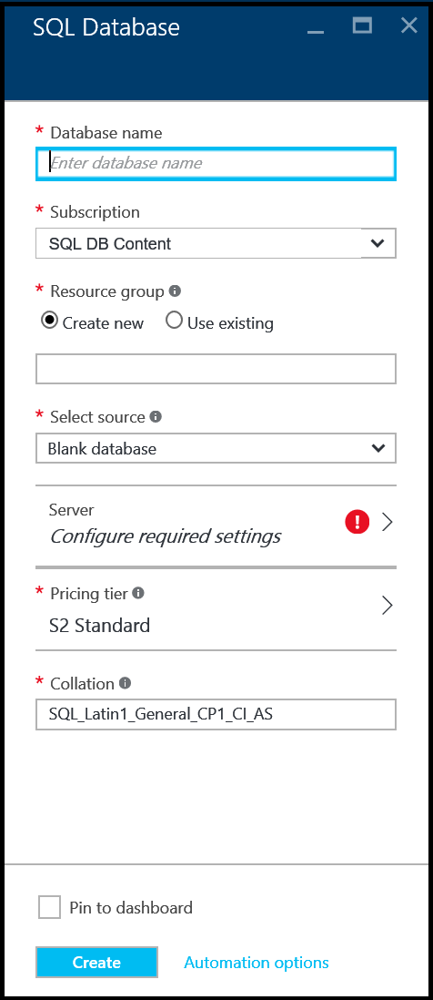
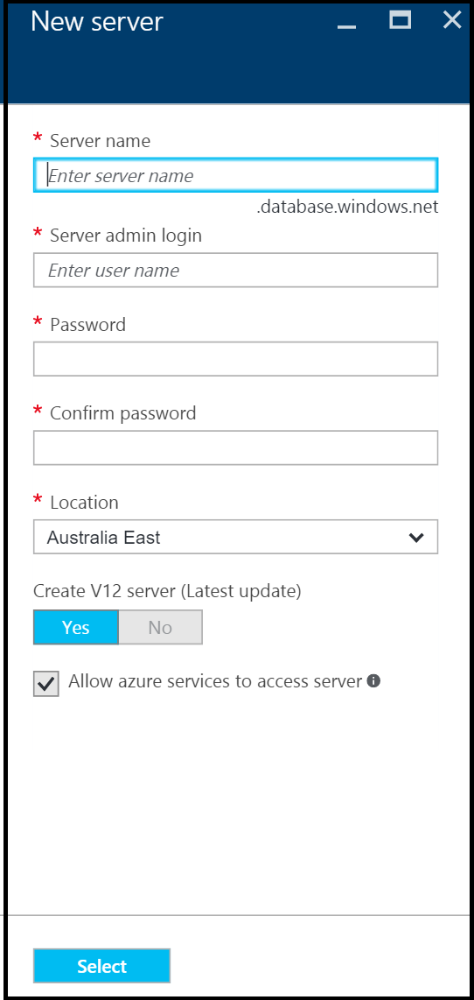
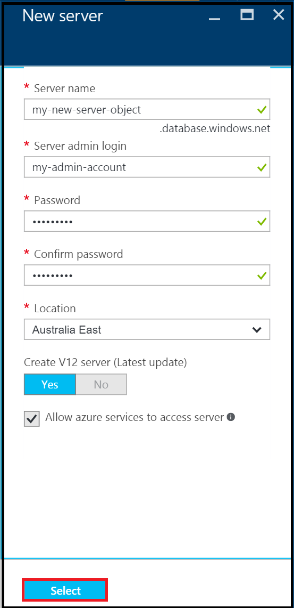

<properties
	pageTitle="SQL 数据库教程：创建 SQL 数据库 | Azure"
	description="了解如何设置 SQL 数据库逻辑服务器、服务器防火墙规则、SQL 数据库和示例数据。此外，了解如何使用客户端工具进行连接、配置用户，以及设置数据库防火墙规则。"
	keywords="SQL 数据库教程, 创建 SQL 数据库"
	services="sql-database"
	documentationCenter=""
	authors="CarlRabeler"
	manager="jhubbard"
	editor=""/>  

<tags
	ms.service="sql-database"
	ms.workload="data-management"
	ms.tgt_pltfrm="na"
	ms.devlang="na"
	ms.topic="hero-article"
	ms.date="09/07/2016"
	ms.author="carlrab"/>  

# SQL 数据库教程：使用 Azure 门户在几分钟内创建一个 SQL 数据库

> [AZURE.SELECTOR]
- [Azure 门户](/documentation/articles/sql-database-get-started/)
- [C#](/documentation/articles/sql-database-get-started-csharp/)
- [PowerShell](/documentation/articles/sql-database-get-started-powershell/)

本教程介绍如何使用 Azure 门户完成以下任务：

- 使用示例数据创建一个 Azure SQL 数据库。
- 创建单个 IP 地址或一系列 IP 地址的服务器级别防火墙规则。

也可以使用 [C#](/documentation/articles/sql-database-get-started-csharp/) 或 [PowerShell](/documentation/articles/sql-database-get-started-powershell/) 来执行上述相同的任务。

[AZURE.INCLUDE [登录](../../includes/azure-getting-started-portal-login.md)]

## 创建首个 Azure SQL 数据库 

1. 如果当前未连接，请连接到 [Azure 门户](http://portal.azure.cn)。
2. 依次单击“新建”和“数据 + 存储”，找到“SQL 数据库”。

      

3. 单击“SQL 数据库”打开“SQL 数据库”边栏选项卡。此边栏选项卡上的内容根据订阅和现有对象（例如现有服务器）的数目而有所不同。

      

4. 在“数据库名称”文本框中提供第一个数据库的名称 - 例如“my-database”。绿色复选标记表示提供的名称有效。

      

5. 如果有多个订阅，请选择一个订阅。
6. 在“资源组”下面，单击“新建”并提供第一个资源组的名称 - 例如“my-resource-group”。绿色复选标记表示提供的名称有效。

      

7. 在“选择源”下单击“示例”，然后在“选择示例”下单击“AdventureWorksLT [V12]”。

      

8. 在“服务器”下，单击“配置所需的设置”。

      

9. 在“服务器”边栏选项卡中，单击“创建新服务器”。Azure SQL 数据库是在服务器对象（可以是新服务器或现有服务器）中创建的。

      

10. 查看“新建服务器”边栏选项卡，了解需要为新服务器提供哪些信息。

      

11. 在“服务器名称”文本框中提供第一个服务器的名称 - 例如“my-new-server-object”。绿色复选标记表示提供的名称有效。

      

 
12. 在“服务器管理员登录名”下，提供此服务器的管理员登录名的用户名 - 例如“my-admin-account”。此登录名称为服务器主体登录名。绿色复选标记表示提供的名称有效。

      

13. 在“密码”和“确认密码”下，提供服务器主体登录帐户的密码 - 例如“p@ssw0rd1”。绿色复选标记表示提供的密码有效。

      

 
14. 在“位置”下，选择所在位置可用的数据中心 - 例如“中国东部”。

      

15. 请注意，在“创建 V12 服务器(最新更新)”下，只有创建最新版本 Azure SQL 服务器的选项。

      

16. 请注意，“允许 Azure 服务访问服务器”复选框默认已选中，无法在此处更改。这是一个高级选项。可以在此服务器对象的服务器防火墙设置中更改此设置，不过在大多数情况下并不需要这样做。

      

17. 在“新建服务器”边栏选项卡中查看所做的选择，然后单击“选择”，为新数据库选择这个新服务器。

      

18. 在“SQL 数据库”边栏选项卡中的“定价层”下，单击“S2 标准”，然后单击“基本”，为第一个数据库选择价格最低的定价层。以后随时可以更改定价层。

      

19. 在“SQL 数据库”边栏选项卡中查看所做的选择，然后单击“创建”以创建第一个服务器和数据库。系统将验证提供的值，随后开始部署。

      

20. 在门户工具栏中，单击“通知”项查看部署状态。

      

>[AZURE.IMPORTANT]部署完成后，将在 Azure 中创建新的 Azure SQL 服务器和数据库。在创建服务器防火墙规则，针对来自 Azure 外部的连接打开 SQL 数据库防火墙之前，无法使用 SQL 服务器工具连接到新服务器或数据库。

[AZURE.INCLUDE [创建服务器防火墙规则](../../includes/sql-database-create-new-server-firewall-portal.md)]

## 后续步骤
现已完成本 SQL 数据库教程并创建了包含一些示例数据的数据库，接下来可以使用偏好的工具来探索其他功能。

- 如果熟悉 Transact-SQL 和 SQL Server Management Studio (SSMS)，请学习如何[使用 SSMS 连接和查询 SQL 数据库](/documentation/articles/sql-database-connect-query-ssms/)。

- 如果熟悉 Excel，请学习如何[使用 Excel 连接到 Azure 中的 SQL 数据库](/documentation/articles/sql-database-connect-excel/)。

- 如果已准备好开始编写代码，请在[用于 SQL 数据库和 SQL Server 的连接库](/documentation/articles/sql-database-libraries/)中选择所需的编程语言

- 若要将本地 SQL Server 数据库移到 Azure，请参阅[将数据库迁移到 SQL 数据库](/documentation/articles/sql-database-cloud-migrate/)了解详细信息。

- 若要使用 BCP 命令行工具将 CSV 文件中的某些数据载入新表，请参阅[使用 BCP 将 CSV 文件中的数据载入 SQL 数据库](/documentation/articles/sql-database-load-from-csv-with-bcp/)。

- 若要开始探索 Azure SQL 数据库安全性，请参阅[安全入门](/documentation/articles/sql-database-get-started-security/)

## 其他资源

[什么是 SQL 数据库？](/documentation/articles/sql-database-technical-overview/)

<!---HONumber=Mooncake_Quality_Review_1118_2016-->